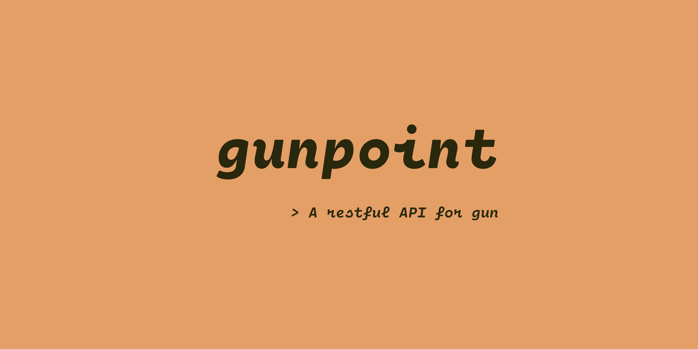

# Gunpoint API
Gunpoint is a restful API for [gun.js](https://github.com/amark/gun). 

     

You can fire it up with :
```sh
npm run start
```
or use `npx gunpoint` to instantly create a supercharged relay !

You can also use the Docker package :
```sh
docker pull ghcr.io/noctisatrae/gunpoint:master
```

If you want to try Gunpoint, [it's here !](https://gunpoint.herokuapp.com) (Main playground running latest release) \
\
**By the way, take a look at what's comming next :**

- [ ] A `/set` URI using `gun.set()`
- [ ] Be able to submit array (array to JS Object function)
- [ ] Redis caching support
- [ ] Improve CLI !
- - [ ] Find another way to make gunpoint beautiful !
- - [ ] Support passing args in command line.
- [X] Be able to configure Gun with `config.json`
- [X] Docker image with CI on `master` branch

## What you can do, currently :
`/get/[key]`: Use it to get data from a definied graph (`GET` request). \
`/put/[key] + request body (in JSON)`: Add data in a specified graph (`POST` request). \
`/put/[graph 1]/in/[graph 2]`: Put the graph 1 in the graph 2 (`POST` request). \
`/delete/[data]/in/[graph]`: Delete defined data in a specified graph (DELETE request).
